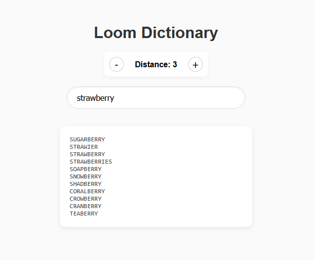

# loom

### Initialization

| Operation      | Dataset       | Min Time      | Iterations/sec |
| :------------- | :------------ | :------------ | :------------- |
| **Build Trie** | 180,000 words | **751.01 ms** | 1.21           |

### Query Latency

| Operation              | Short Word ("cat") | Long Word ("strawberry") |
| :--------------------- | :----------------- | :----------------------- |
| **Lookup (`get`)**     | 0.0006 ms          | 0.0010 ms                |
| **Prefix Search**      | 0.0006 ms          | 0.0010 ms                |
| **Delete**             | 0.0006 ms          | 0.0010 ms                |
| **Fuzzy Search (d=1)** | 0.0645 ms          | 0.0666 ms                |
